# Tradie E2E user journey — missed call → invoice

Typical UK tradie flow exercised against the local API (seed account `seed_tm_demo_plumbing`).

## Persona

**Dave's Plumbing** (`seed_tm_demo_plumbing`) — ACTIVE subscriber with a Twilio number (`+447000001001`). Customer is a homeowner whose boiler is leaking.

## Journey map

```mermaid
flowchart LR
  MissedCall[Missed call webhook] --> SmsQualify[Customer SMS reply]
  SmsQualify --> Inbox[Inbox enquiry]
  Inbox --> Promote[Promote to job]
  Promote --> QuoteCreate[Create quote and lines]
  QuoteCreate --> Send[Approve and send quote]
  Send --> Accept[Customer accepts quote]
  Accept --> Invoice[Invoice from quote]
  Invoice --> SendInv[Send invoice]
  SendInv --> Paid[Mark paid]
```

| Step | Actor | API |
|------|--------|-----|
| 0 | System | `POST /api/t/auth/seed-login` |
| 1 | Caller / Twilio | `POST /api/twilio/voice/missed` then `POST /api/twilio/sms/inbound` |
| 2 | Tradie | `GET /api/t/inbox` → `POST /api/t/jobs/:enquiryId/promote` |
| 3 | Tradie | `POST /api/t/quotes` (+ attach enquiry) → `PUT .../lines` → `POST .../approve` |
| 3alt | Tradie | `POST /api/t/jobs/:id/notes` (AI draft — needs Claude; harness uses manual lines when unset) |
| 4 | Customer | `POST /q/:token/accept` |
| 5 | Tradie | `POST /api/t/invoices/from-quote/:id` → `POST .../send` → `POST .../mark-paid` |

## Success criteria

- Inbox item created from SMS qualify (`source` missed_call family)
- Job exists after promote (`pipeline: JOB`)
- Quote reaches `SENT` with public `/q/...` page
- Quote becomes `ACCEPTED`
- Invoice reaches `PAID` with public `/i/...` page

## Last run

`23/23 PASS` — journey completed flawlessly (local API `:4000`, seed account, Twilio stub / no Claude).

Run: `node scripts/e2e-tradie-journey.mjs` (API must be on `:4000`).
