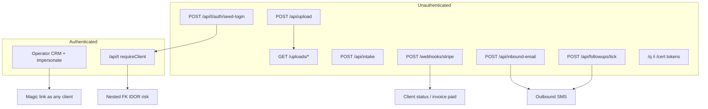

# TradiesMate Security Audit

**Date:** 2026-08-08  
**Scope:** Focused code review — authentication, tenant isolation (IDOR), public endpoints, webhooks, secrets / sensitive data  
**Method:** Static review of server routes, middleware, auth services, storage, and env handling. No live penetration testing or dependency CVE scan.  
**Deliverable:** Findings and remediations only (no code changes in this pass).

---

## Executive summary

TradiesMate has solid foundations in places: Twilio webhooks fail closed in production without an auth token, Stripe signature verification is correctly implemented when configured, OTP and magic-link tokens are hashed at rest, and most primary `/api/t` lookups scope by `clientId`.

The highest risks are **misconfiguration-tolerant production paths** (Stripe webhook and cron tick that skip auth when secrets/headers are absent), **unauthenticated file upload + static serving**, **seed-account passwordless login** that remains reachable in production, and several **cross-tenant nested-FK / idempotency IDOR** bugs that can leak PII or price-book data between tradies.

| Severity | Count |
|----------|------:|
| Critical | 3 |
| High     | 6 |
| Medium   | 7 |
| Low      | 4 |

---

## Critical

### C1 — Stripe webhook accepts unsigned events when secret is unset

**Where:** [`server/src/routes/stripeWebhook.ts`](../server/src/routes/stripeWebhook.ts) (lines 62–66), [`server/src/env.ts`](../server/src/env.ts) (`STRIPE_WEBHOOK_SECRET` defaults to `""`)

```ts
if (env.STRIPE_WEBHOOK_SECRET) {
  if (!verifyStripeSignature(...)) {
    return res.status(400).json({ error: "invalid signature" });
  }
}
// else: parse and apply event with no verification
```

**Impact:** Anyone who can POST to `/webhooks/stripe` can mark invoices paid, flip client subscription status (`ACTIVE` / `CANCELLED` / `PAST_DUE`), and trigger onboarding / SMS side effects via forged `checkout.session.completed` or subscription events with attacker-chosen `metadata.clientId`.

**Remediation:** In production, reject all webhook requests unless `STRIPE_WEBHOOK_SECRET` is set and the signature verifies. Prefer fail-closed boot (or at least refuse the route) rather than silent skip. Keep verification always-on whenever Stripe is configured.

---

### C2 — Follow-up cron endpoint auth is bypassed when header is omitted

**Where:** [`server/src/routes/quotePublic.ts`](../server/src/routes/quotePublic.ts) (`POST /api/followups/tick`)

```ts
if (env.MAGIC_LINK_SECRET && secret && secret !== env.MAGIC_LINK_SECRET) {
  throw new ApiError(401, ...);
}
```

**Impact:** The check only fails when a *wrong* secret is supplied. Omitting `x-cron-secret` entirely always succeeds. An attacker can trigger quote follow-up SMS/email sends at will (spam / cost abuse). The process already runs an internal `setInterval` ticker in [`server/src/index.ts`](../server/src/index.ts), so this public route is unnecessary risk.

**Remediation:** Require `x-cron-secret === MAGIC_LINK_SECRET` (or a dedicated `CRON_SECRET`) with timing-safe compare; reject when missing. Prefer removing the HTTP endpoint and relying on the in-process ticker, or gate it behind operator auth / private network.

---

### C3 — Unauthenticated upload + world-readable `/uploads`

**Where:** [`server/src/routes/upload.ts`](../server/src/routes/upload.ts), [`server/src/index.ts`](../server/src/index.ts) (`app.use("/uploads", express.static(...))`), [`server/src/services/storage/store.ts`](../server/src/services/storage/store.ts)

**Impact:**
- `POST /api/upload` accepts base64 images from any origin (open CORS), no auth, MIME allowlist only (trusted client `contentType`, no magic-byte check). Cap is 8 MB → easy storage abuse / malware hosting.
- All stored files (customer docs, cert PDFs, voice notes, logos, generated PDFs) are served without authentication. Filenames use `Date.now()` + 5 random bytes (~40 bits) — weaker than public quote/invoice tokens (24 bytes). Anyone with a leaked URL (SMS, HTML email, invoice page, cert redirect, logs) gets the file forever.

**Remediation:** Rate-limit and optionally require a short-lived upload token tied to `routeKey` / session. Serve private files via authenticated or signed URLs; keep only intentionally public assets open. Use longer random names; validate magic bytes against claimed MIME.

---

## High

### H1 — Seed login grants full sessions without SMS (production-reachable)

**Where:** [`server/src/routes/tradie.ts`](../server/src/routes/tradie.ts) `POST /api/t/auth/seed-login`

**Impact:** Any client whose `routeKey` starts with `seed_tm_` can be logged into with a single unauthenticated POST. Seed route keys are predictable ([`server/prisma/seed/markers.ts`](../server/prisma/seed/markers.ts): `seed_tm_demo_plumbing`, etc.). If seed data is left in a production DB, this is a full account takeover of those tenants (jobs, customers, bank fields on `/me`, messaging).

**Remediation:** Disable the route unless `NODE_ENV !== production` (or an explicit `ALLOW_SEED_LOGIN=true`). Wipe seed clients before launch (`db:seed:wipe`). Do not document production seed keys.

---

### H2 — Cross-tenant quote template leak via duplicate idempotency

**Where:** [`server/src/routes/tradie.ts`](../server/src/routes/tradie.ts) `POST /templates/:id/duplicate` (~1614–1622)

**Impact:** When `body.id` collides with an existing template, the handler returns that row (with items/prices) **without** checking `clientId`. Authenticated tenant A can read tenant B’s templates by supplying B’s template id.

**Remediation:** Mirror `POST /templates` clash handling: if clash and `clientId` mismatch → 409; only return own rows.

---

### H3 — Nested foreign keys enable cross-tenant PII / file URL leakage

**Where:**
- [`server/src/routes/customers.ts`](../server/src/routes/customers.ts) — `siteContactId` / `billToCustomerId` on property create/patch; unvalidated `propertyId` / `assetId` / `enquiryId` / `jobId` on notes, files, reminders
- [`server/src/routes/tradie.ts`](../server/src/routes/tradie.ts) — appointment `enquiryId` still written when not owned; certificate `enquiryId`
- [`server/src/routes/jobs.ts`](../server/src/routes/jobs.ts) — job cost `receiptFileId`

**Impact:** Attacker attaches another tenant’s Contact / Enquiry / CustomerFile id to their own resource, then reads it back via includes (name, phone, email, file URL). Classic broken object-level authorization on nested FKs.

**Remediation:** Before persist, `findFirst({ id, clientId })` (and same parent where relevant); reject or null foreign IDs. Add `where: { clientId }` on Prisma includes for nested collections.

---

### H4 — Production secrets warn but do not fail closed

**Where:** [`server/src/env.ts`](../server/src/env.ts) `assertProductionSecrets`

**Impact:** Weak/default `MAGIC_LINK_SECRET` and missing operator credentials only `console.error`. Operator middleware does fail closed if neither operator secret is set, but a weak magic secret still signs OTP hashes, session hashes, and (as fallback) operator session HMACs. Compromising or guessing a weak secret undermines auth material at rest and operator session integrity if sessions were signed with that fallback.

**Remediation:** Fail boot in production on weak `MAGIC_LINK_SECRET` and missing operator auth. Use a dedicated `OPERATOR_SESSION_SECRET`, never fall back to the admin password or magic-link secret for signing.

---

### H5 — Shared operator password with no login rate limit

**Where:** [`server/src/index.ts`](../server/src/index.ts) `POST /api/operator/login`, [`server/src/middleware/operatorAuth.ts`](../server/src/middleware/operatorAuth.ts)

**Impact:** Single shared password protects the entire CRM (leads, clients, impersonation, Twilio admin, settings). No rate limiting on login. Successful login yields a 14-day HMAC session. Compromised password or online brute force → full operator access including [`POST /api/clients/:id/impersonate`](../server/src/routes/clients.ts) (magic link as any tradie).

**Remediation:** Rate-limit login (IP + global). Prefer individual operator accounts / SSO. Audit-log impersonation. Shorten session TTL; support revocation.

---

### H6 — Inbound email webhook: secret optional outside production; body secret; non-constant-time compare

**Where:** [`server/src/routes/inboundEmail.ts`](../server/src/routes/inboundEmail.ts)

**Impact:** Non-prod allows unsigned webhooks (expected). When configured, secret may be sent in JSON body (logged by proxies) and compared with `!==` (timing leak, low practical risk). Successful forge creates enquiries and sends magic-login SMS to the tradie (phishing + SMS cost).

**Remediation:** Require header-only secret (`x-inbound-secret`), timing-safe compare, always require secret when the route is mounted publicly.

---

## Medium

### M1 — Account enumeration on login / signup / magic link

**Where:** `signup` `/login/start`, `/start` (409 exists), `tradie` `/auth/magic` (404 vs success)

**Impact:** Attackers can discover which phones/routeKeys have accounts. Aids targeted OTP / SMS bombing (partially mitigated by rate limits).

**Remediation:** Uniform success responses for start flows; send SMS only when an account exists.

---

### M2 — OTP brute-force window

**Where:** [`server/src/services/auth/otp.ts`](../server/src/services/auth/otp.ts), signup rate limits (12 verifies / 15 min / phone)

**Impact:** 6-digit OTP (~1e6 space). 12 attempts per 15 minutes is moderate; no per-challenge lockout or attempt counter in DB. Distributed attackers rotating IPs may still try (key is phone-based, which helps).

**Remediation:** Lock challenge after N failures; exponential backoff; consider longer codes or WebAuthn later.

---

### M3 — Health endpoint information disclosure

**Where:** [`server/src/index.ts`](../server/src/index.ts) `GET /api/health`

**Impact:** Public JSON exposes integration readiness, pool size, `publicBaseUrl`, `clientOrigins`, `operatorAuthRequired`, `signupsOpen`, commit SHA. Useful for attackers reconnoitering misconfiguration (e.g. operator auth off).

**Remediation:** Split public liveness (`{ ok: true }`) from operator-authenticated diagnostics.

---

### M4 — Bank details on public invoice pages

**Where:** [`server/src/routes/invoicePublic.ts`](../server/src/routes/invoicePublic.ts)

**Impact:** Intentional for BACS, but sort code + account number are exposed to anyone with the invoice token (or a leaked URL). Tokens are strong (`newPublicToken`); risk is link leakage / referrer / shared devices.

**Remediation:** Accept as product risk; use token rotation on send; `Referrer-Policy: no-referrer`; avoid putting full tokens in third-party analytics.

---

### M5 — CORS `origin: true` + credentials on `/api/t`

**Where:** [`server/src/index.ts`](../server/src/index.ts)

**Impact:** Reflects any Origin with `Access-Control-Allow-Credentials: true`. Sessions today live in `localStorage` + Bearer (server can also read `tm_session` cookie). If cookies are ever set for sessions, this becomes classic cross-site credentialed CSRF. Even with Bearer-only, permissive CORS widens XSS blast radius on attacker-controlled pages that a user might be tricked into combining with stolen tokens.

**Remediation:** Allowlist tradie app origins (same as `APP_PUBLIC_URL` / Capacitor). Never set session cookies without `SameSite=strict` / CSRF tokens.

---

### M6 — Settings secrets on local disk

**Where:** [`server/src/settings.ts`](../server/src/settings.ts) → `settings.local.json`

**Impact:** Runtime overrides for Places/Twilio/Claude/OpenAI keys written to disk on the API host. On ephemeral hosts (Railway) this is fragile and may surprise ops; on persistent disk, secrets sit outside the secret manager. Admin GET correctly masks values.

**Remediation:** Prefer env / secret manager only in production; if file override remains, encrypt at rest and exclude from any backups/artifacts.

---

### M7 — Operator session signed with password-derived secret

**Where:** [`server/src/middleware/operatorAuth.ts`](../server/src/middleware/operatorAuth.ts) `sessionSigningSecret()`

**Impact:** Signing key preference is `OPERATOR_API_TOKEN` → `OPERATOR_ADMIN_PASSWORD` → `MAGIC_LINK_SECRET`. Rotating the login password invalidates sessions (good) but also means the long-lived password *is* the HMAC key. Password reuse / low entropy weakens session tokens.

**Remediation:** Dedicated high-entropy `OPERATOR_SESSION_SECRET`.

---

## Low

### L1 — No security headers / Helmet

Express app does not set CSP, HSTS, `X-Content-Type-Options`, etc. on HTML surfaces (`/q`, `/i`, `/cert`, `/sites`).

### L2 — Public “I’ve paid” on invoices

`POST /i/:token/paid` lets anyone with the token claim bank transfer payment (notifies tradie; does not auto-mark PAID without confirmation path). Spam / social-engineering noise.

### L3 — CRM CORS allows all `*.vercel.app`

Preview deployments of *any* Vercel project can call CRM APIs from a browser if they obtain an operator token (XSS on a preview, or malicious preview). Tighten to your project’s Vercel domain(s).

### L4 — Child queries omit redundant `clientId`

Job messages / quotes sometimes filter by `enquiryId` only after the job was ownership-checked. Safe today; fails open if FK pollution (H3) ever links a foreign enquiry.

---

## Positive controls observed

| Control | Notes |
|---------|--------|
| Twilio signature middleware | Fail-closed in production without auth token; HMAC verified with timing-safe compare |
| Stripe HMAC implementation | Correct `t.v1` scheme + skew window when secret present |
| Magic / session / OTP hashing | SHA-256 with server secret; magic consume is transactional + replay grace cache |
| Primary tenant lookups | Most `findFirst({ id, clientId })` patterns on quotes, jobs, customers, invoices, certs |
| Access codes | Masked by default; reveal endpoint audited (`AccessReveal`) and ownership-checked |
| Intake | Rate limit + honeypot; gated by `routeKey` |
| OTP / magic start | Rate limited |
| Operator CRM | Protected when secrets configured; prod returns 503 if unset |
| Public money/cert tokens | Unguessable `newPublicToken()` (24 bytes) |
| HTML docs | `esc()` used on invoice/quote/cert templates (spot-checked) |

---

## Priority remediation roadmap

1. **Immediate (config / small code):** Fail closed on Stripe webhook without secret (C1); fix follow-ups tick auth or remove endpoint (C2); disable seed-login in production (H1); enforce strong `MAGIC_LINK_SECRET` + operator secrets at boot (H4).
2. **Next:** Auth or signed URLs for `/uploads`; harden public upload (C3); fix template duplicate IDOR (H2); validate all nested FKs (H3); rate-limit operator login (H5).
3. **Then:** Enumeration-safe auth responses (M1); trim health endpoint (M3); CORS allowlists (M5); dedicated session signing secrets (M7 / H4).

---

## Out of scope (not reviewed in depth)

- Client-side XSS / React `dangerouslySetInnerHTML` sweep  
- Dependency vulnerability / supply-chain scan (`npm audit`)  
- Mobile (Capacitor) storage and certificate pinning  
- Infrastructure (Railway/Vercel IAM, DB network exposure, backup encryption)  
- Formal threat model / abuse-case workshop with product  

---

## Appendix — high-risk surface map


